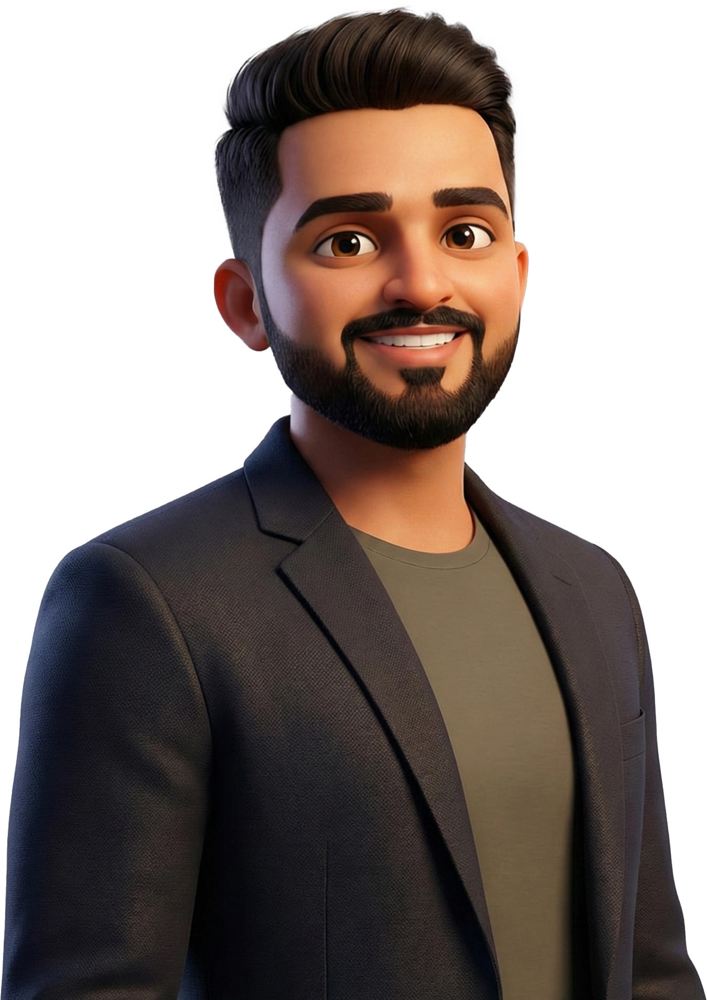

# Dev Shrimali - Creative UX/UI Portfolio



> An advanced, interactive portfolio website crafted with Next.js, motion physics, and industrial aesthetics.

## 🚀 Overview

This project is a high-performance personal portfolio website designed to showcase advanced UX/UI engineering capabilities. It moves beyond static layouts to offer a deeply immersive user experience, characterized by fluid animations, custom WebGL backgrounds, and "system-level" interactions.

The design language fuses **modern minimalism** with **industrial cyberpunk** elements—featuring scanlines, glitch effects, monospace typography, and dynamic glowing accents.

## ✨ Key Features

-   **🌊 Global Smooth Scrolling**: Integrated **Lenis** for a silky-smooth scrolling experience across the entire application, normalizing scroll behavior on all devices.
-   **⚡ Interactive Workflow Accordion**: A custom-built **Framer Motion** accordion that expands with natural spring physics, revealing detailed process steps with staggered text animations.
-   **♾️ Infinite Loops**:
    -   **Services Carousel**: A seamless, auto-scrolling carousel that never pauses, creating a constant flow of information.
    -   **Client Marquee**: Auto-scrolling list of past collaborations and employers.
-   **🎨 Cinematic Visuals**:
    -   **WebGL Noise Backgrounds**: Custom shader-based static noise effects for a gritty, filmic texture.
    -   **Scanlines & Vignettes**: Global CSS overlays that mimic CRT screens and retro interfaces.
    -   **Parallax Hero**: Layered hero section with depth and motion sensitivity.
-   **🖱️ Custom Physics Cursor**: A custom-coded circular cursor that trails the mouse with spring-based delay and magnetically snaps/reacts to interactive elements.
-   **📱 Fully Responsive**: Optimized for all viewports from mobile devices to ultra-wide desktop monitors.

## 🛠️ Tech Stack

-   **Framework**: [Next.js 14](https://nextjs.org/) (App Router)
-   **Language**: [TypeScript](https://www.typescriptlang.org/)
-   **Styling**: [Tailwind CSS](https://tailwindcss.com/)
-   **Animation**: [Framer Motion](https://www.framer.com/motion/)
-   **Scrolling**: [Lenis](https://lenis.studio/)
-   **Icons**: [Lucide React](https://lucide.dev/)
-   **Fonts**: Syne (Headers) & Space Grotesk (Body)

## 📂 Project Structure

```bash
portfolio/
├── app/
│   ├── layout.tsx       # Root layout with SmoothScroller & CustomCursor
│   ├── page.tsx         # Main landing page composition
│   └── globals.css      # Global styles, scanlines, and tailwind directives
├── components/
│   ├── hero-section.tsx      # Parallax hero with layered visuals
│   ├── process-section.tsx   # Interactive Framer Motion accordion
│   ├── services-section.tsx  # Infinite scrolling services carousel
│   ├── smooth-scroller.tsx   # Lenis integration wrapper
│   ├── custom-cursor.tsx     # Custom cursor logic
│   └── ...
└── public/              # Static assets and images
```

## 🚀 Getting Started

1.  **Clone the repository**:
    ```bash
    git clone https://github.com/DevShrimali/UX-Portfolio.git
    cd UX-Portfolio
    ```

2.  **Install dependencies**:
    ```bash
    npm install
    ```

3.  **Run the development server**:
    ```bash
    npm run dev
    ```

4.  Open [http://localhost:3000](http://localhost:3000) with your browser to see the result.

## 🤝 Collaboration

This project highlights experience with:
-   **EnlightVision Technologies**
-   **Konzept Solutions**
-   **VMG Software Solutions**
-   **Pixeltec Digital Wallpaper**

---

© 2025 Dev Shrimali. All Rights Reserved.
